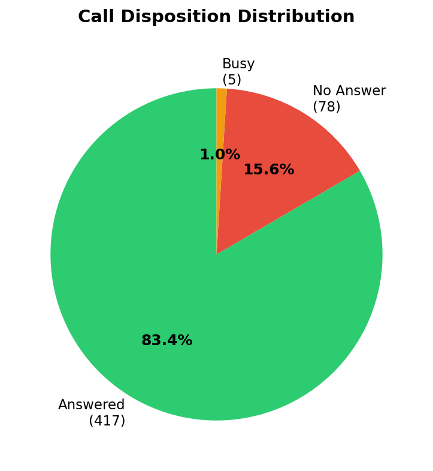
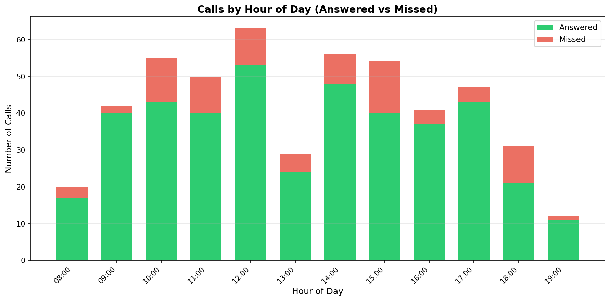
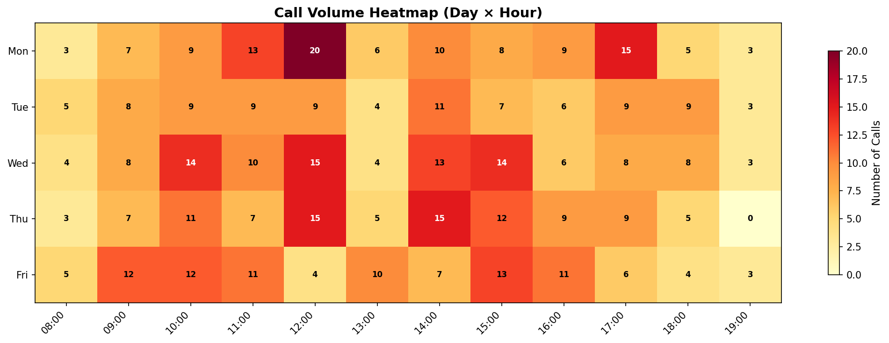
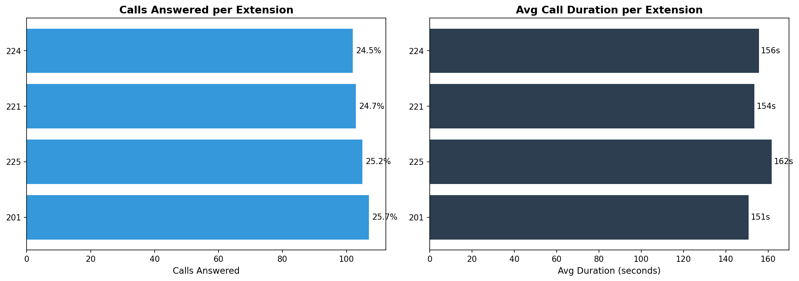

# 🦷 Dental Clinic CDR Analyzer

[](https://python.org)
[](https://anthropic.com)
[](LICENSE)

**A Python pipeline that analyzes Call Detail Records (CDR) from an Asterisk/FreePBX dental clinic phone system and generates AI-powered executive reports with actionable business recommendations.**

Built from real-world experience managing IT infrastructure for dental clinics since 2011.

---

## The Problem

A dental clinic's phone system generates thousands of CDR records, but raw data is misleading. A single incoming call produces **7-8 records** because the PBX queue rings multiple extensions simultaneously. Without proper deduplication, a clinic that answers 84% of calls appears to miss 81% of them.

This tool solves that by building a complete data pipeline: ingestion → deduplication → KPI calculation → visualization → AI-powered analysis.

## Sample Output

### Call Distribution


### Hourly Traffic (Answered vs Missed)


### Day × Hour Heatmap


### Extension Performance


## Features

- **Smart Deduplication** — Groups raw CDR records by `linkedid` to identify real unique calls, correctly handling PBX queue and ring group behavior
- **Call Direction Classification** — Separates inbound (patients), outbound (clinic calls out), and internal (transfers) — KPIs only measure what matters: inbound external calls
- **Voicemail Detection** — Identifies calls answered by voicemail (vmu/vms extensions) as a separate category from person-answered calls
- **Business KPIs** — Answer rate, miss rate, voicemail rate, hourly/weekly distribution, extension performance, quarterly trends, top callers
- **Professional Charts** — 5 publication-ready visualizations (pie, stacked bars, heatmap, extension comparison)
- **AI-Powered Reports** — Sends KPIs to Claude API with clinic-specific context to generate executive reports with actionable recommendations
- **Demo Mode** — Works without API key using a template-based report with real KPI data

## Architecture

````
FreePBX CSV Export
       |
       ▼
  ingest.py ──▶ kpis.py ──▶ visualize.py ──▶ ai_report.py
       |            |              |                |
  Load CSV      Answer rate    Pie chart       Claude API
  Parse dates   Miss rate      Hourly bars     or demo mode
  Clean phones  Voicemail %    Heatmap
  Classify dir  By hour/day    Extensions      Executive
  Deduplicate   By extension   Weekday bars    report .md
  by linkedid   Quarterly
````
````

## Quick Start

### 1. Clone and install

```bash
git clone https://github.com/vjsoriano83/dental-clinic-cdr-analyzer.git
cd dental-clinic-cdr-analyzer
pip3 install -r requirements.txt
```

### 2. Run with sample data

```bash
python3 main.py
```

### 3. Run with your own data

Export CDRs from FreePBX (`Reports → CDR Reports → Download CSV`), place them in `data/`, and run:

```bash
python3 main.py "data/*.csv"
```

### 4. Enable AI reports (optional)

```bash
cp .env.example .env
# Edit .env and add your Anthropic API key
python3 main.py
```

## Project Structure

```
dental-clinic-cdr-analyzer/
├── main.py                 # Entry point — runs the full pipeline
├── requirements.txt        # Python dependencies
├── .env.example            # API key template
│
├── src/
│   ├── ingest.py           # Load, clean and deduplicate CDR data
│   ├── kpis.py             # Calculate business KPIs
│   ├── visualize.py        # Generate charts (PNG)
│   └── ai_report.py        # AI-powered report generation
│
├── data/
│   ├── sample_cdr.csv      # Synthetic sample data (500 calls)
│   └── README.md           # Data format documentation
│
└── output/
    ├── charts/             # Generated charts
    └── report_sample.md    # Generated executive report
```

## Technologies

| Technology | Purpose |
|-----------|---------|
| Python 3 | Core language |
| pandas | Data ingestion, transformation and analysis |
| matplotlib | Chart generation |
| Anthropic SDK | Claude API for AI-powered report generation |
| Asterisk/FreePBX | Source PBX system (CDR export) |

## Key Insight: Why Deduplication Matters

Raw CDR data from a PBX is **not** one row per call. When a call enters queue 251, the system generates:
- 4 records in `ext-queues` (one per ring group member)
- 4 records in `ext-local` (one per extension attempt)

A single call = 8 records. Without deduplication:
- 250,000 records look like 250,000 calls → **81% NO ANSWER** 😱
- After deduplication: 33,000 real calls → **76% answered** ✅

The `linkedid` field links all records from the same call. This pipeline groups by `linkedid` and resolves each call's true outcome.

## About the Author

**Víctor Soriano Tárrega** — Senior Project & Programme Manager with 18+ years in telecom, IT infrastructure, and data. Currently managing B2B and Public Sector programmes at MasOrange. Former Technical Lead and Data Scientist at Orange Spain. IT consultant for dental clinics since 2011.

- 🔗 [LinkedIn](https://www.linkedin.com/in/vjsoriano)
- 🐙 [GitHub](https://github.com/vjsoriano83)

## License

MIT License — see [LICENSE](LICENSE) for details.